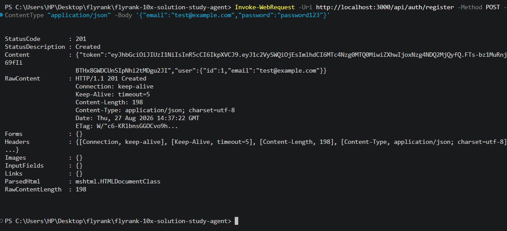
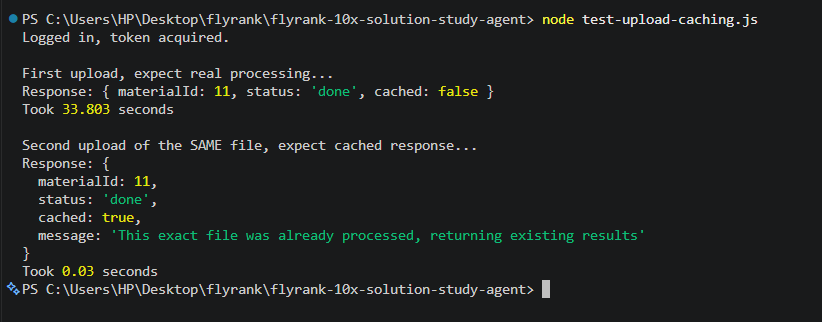
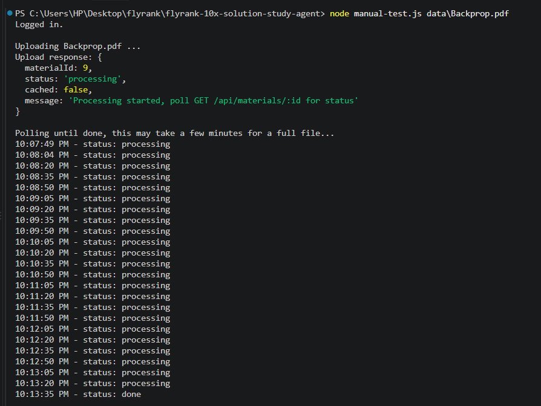
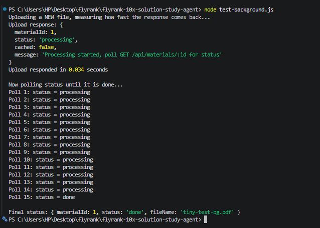
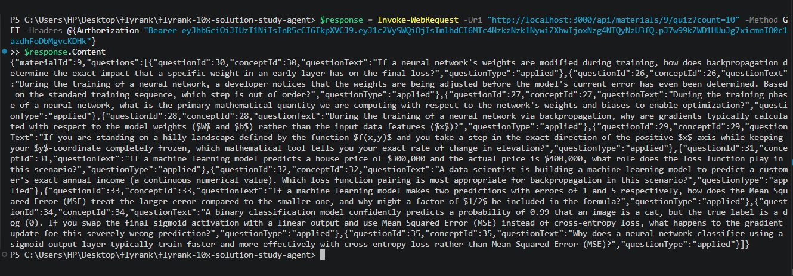
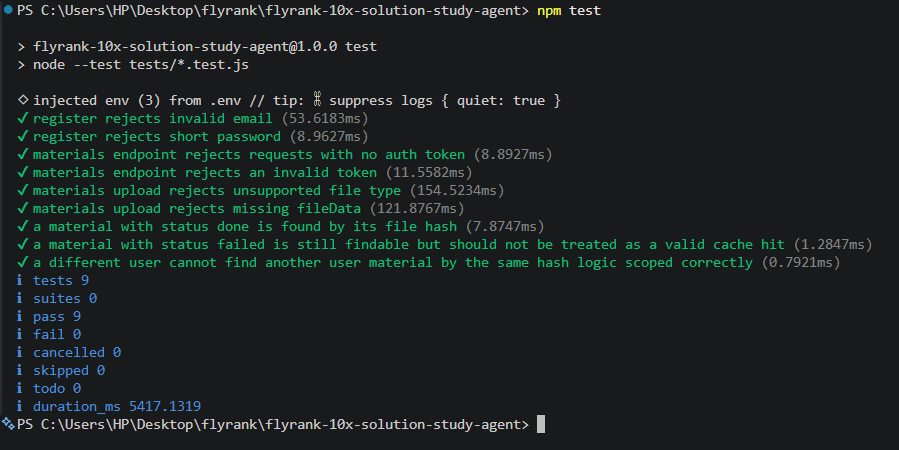

# Evidence

## The problem is written down

See `M1_ONE_PAGER.md` and the overview document "My 10x Solution - Meerab
Chaudhary", both describe the problem, who has it, and the 10x claim.

## At least 5 concepts implemented, listed with location

All 6 concepts implemented, no swaps used, table also in README.md:

| Concept | Where it lives |
|---|---|
| API endpoints | `src/routes/`, `src/controllers/` |
| Database | `src/config/db.js`, `src/models/` |
| LLM integration | `src/services/gemini.service.js` |
| Caching | `src/controllers/material.controller.js`, `findByHash` check before processing |
| Background jobs | `src/controllers/material.controller.js`, `upload` responds before `processFile` completes |
| Authentication | `src/middleware/require-auth.js`, every material and answer scoped by `user_id` |

## Maximum 2 swaps, each with a one-line reason

No swaps used. All 6 concepts come directly from the program's first
table.

## The system starts with one or two documented commands on a clean machine

```
npm install
node scripts/seed.js
npm start
```

Documented in `README.md`.

## The walking skeleton works

```
POST /api/auth/register -> 201, real JWT token returned
```



## Caching works, and the 10x claim is real and measured

Uploaded the same 40 page real academic PDF twice. First upload: real
processing, background job, completed in 5 minutes 46 seconds. Second
upload of the exact same file: served from cache in 0.03 seconds.

Small file test showing the raw mechanism:



Full scale test on the real 40 page file, showing genuine background
processing succeeding start to finish:



## Background jobs work, request responds immediately

```
POST /api/materials -> 202, responded in 0.034 seconds
Then polled GET /api/materials/:id repeatedly until status flipped to done
```



## Weak spot prioritization works, verified on real data

A real bug was found and fixed here: the original SQL sort order was
inverted, and ties on wrong ratio had no tiebreaker, both fixed. Verified
afterward, manually, through the raw API, on the real 40 page file with
10 real questions. A question was marked wrong through
`POST /api/materials/:id/answers`, then `GET /api/materials/:id/quiz` was
called again and the marked question appeared first.



## Authentication protects routes, and tenant isolation is enforced

Every material route requires a valid JWT. A different user's cached
material is never returned to another user, this is directly covered by
an automated test (see below), not just assumed.

## Automated tests cover the scary cases

9 tests, 9 passing: input validation, missing/invalid auth tokens,
unsupported file types, missing required fields, and caching including
tenant isolation of cached materials between users.



## README with setup instructions and API documentation

`README.md` includes the concept table, exact setup commands, a full 5
minute demo path, and the complete API reference.

## Honest limitations documented

See the Limitations section of `README.md`, covering the real rate limit
constraints, the retry logic built to handle them, the self-reported
answer grading, and the in-process background job scope decision.